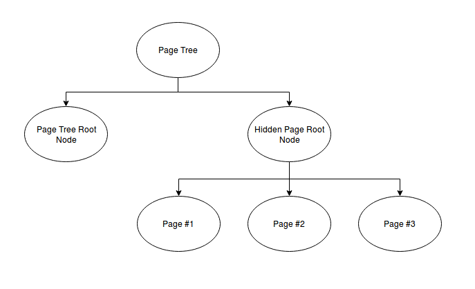
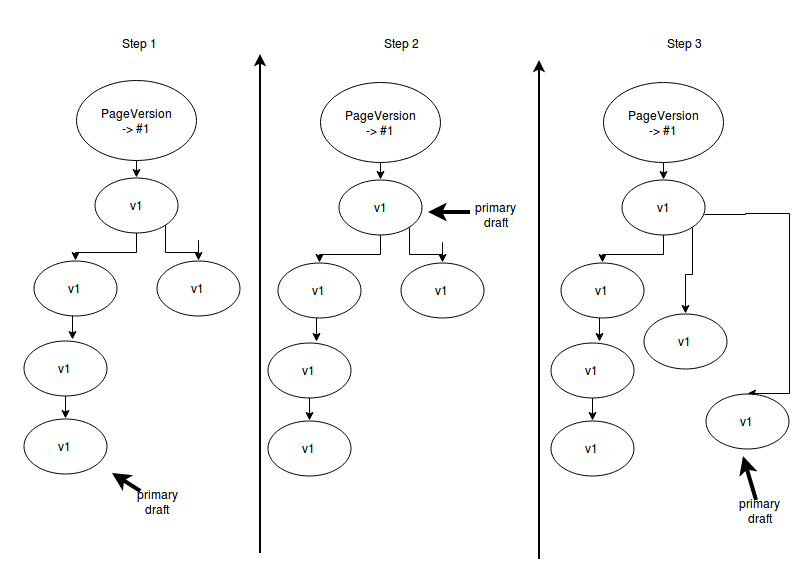

Refactor the Reversion
======================

We don't want to use the Reversion backend anymore.
Therefore we will persist the versioned pages in a second tree (MP_Tree).


Motivation
----------

1. Working on multiple drafts
2. Not loosing constraints
3. Performance


Idea
----

1. The drafts are copied to a hidden root node in the page tree.
2. When the user publishes a page or clicks a button the current draft is synchronized
to the current draft in the PageVersion tree. 
3. There is always a PageVersion draft with the attribute ```primary draft```.
4. UI: We add a drop down to the page editor
5. UI: We show a button to set the current draft as ```primary draft```


Model
------
**PageVersion** extends MP_Node and has a 1:1-relationship to a Page.
 - ```page```
 - ```primary draft```
 - ```comment```


Trees
--------

We split the trees because we might want to copy pages with children and separate our logic from the page logic.

### PageTree

We add one "hidden" node to the page tree and add all page drafts flat under that node.



### PageVersionTree

On the first layer there are all pages referenced. The version tree is aligned under the PageVersionNode.

One node of the version subtree is always marked as primary. This node is synchronized with the CMS draft page.

If you want to roll back to an older version in the subtree. The ```primary pointer``` moves. If you edit the content
of that node there has to be a branch.

### Rollback

The following diagram show how the primary draft can be rolled back and how a new change to that node should be implemented.


