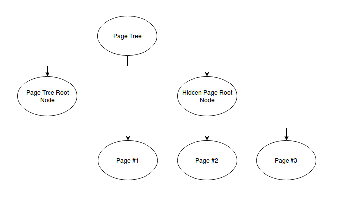
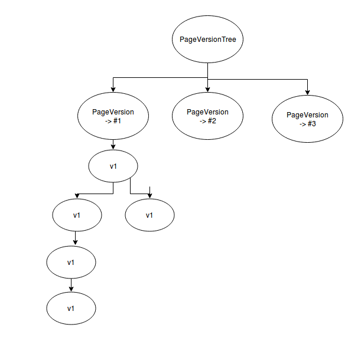

Trees
=====

We split the page tree from the PageVersion tree because we might want to copy pages with children and separate our logic from the page logic.

PageTree
--------

We add one "hidden" node to the page tree and add all page drafts flat under that node.

PageVersionTree
---------------

On the first layer there are all pages referenced. The version tree is aligned under the PageVersionNode.

One node of the version subtree is always marked as primary. This node is synchronized with the CMS draft page.

If you want to roll back to an older version in the subtree. The :code:`primary pointer` moves. If you edit the content
of that node there has to be a branch.

Rollback
--------

The following diagram show how the primary draft can be rolled back and how a new change to that node is implemented.

.. image:: ../img/Rollback.png
    :align: center
    :alt: Rollback
