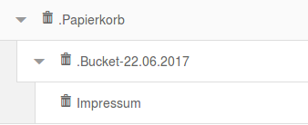
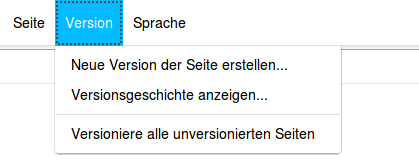
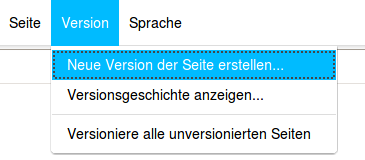
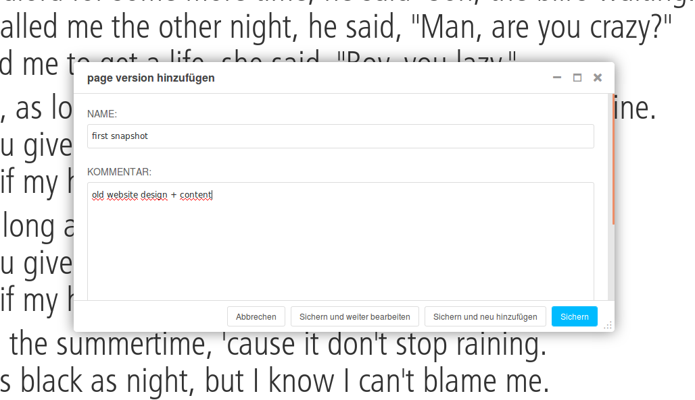
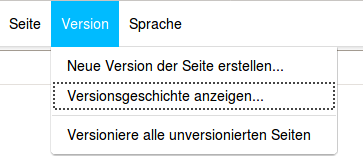
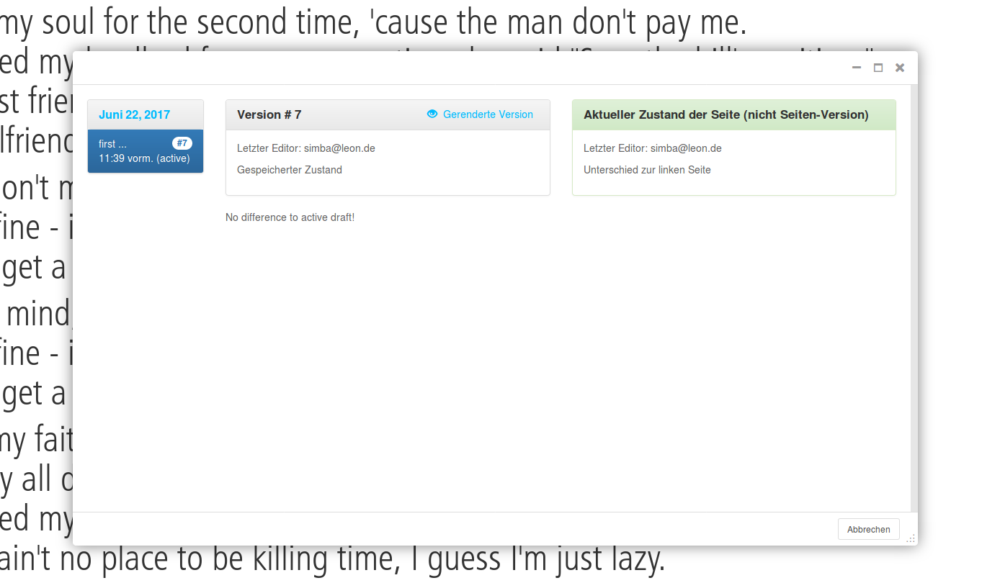
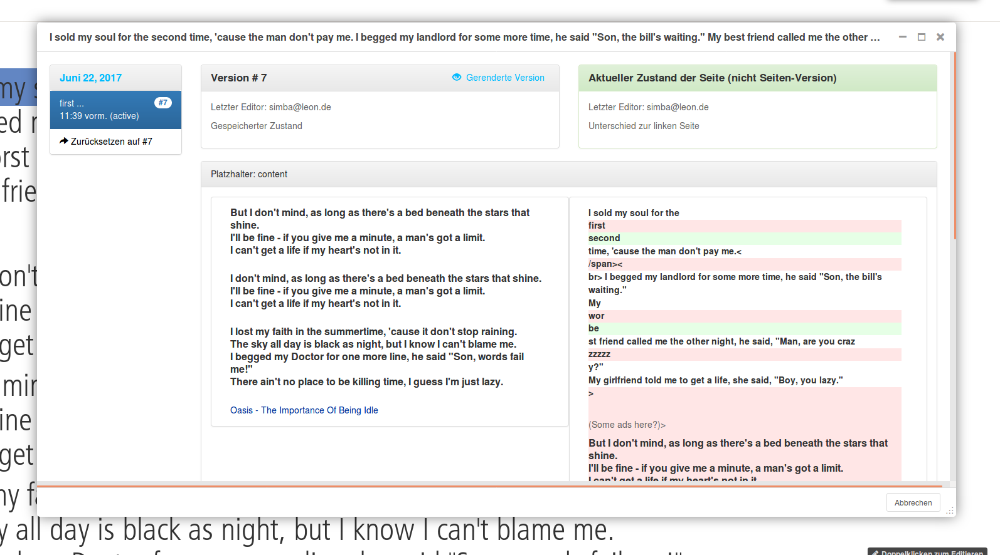
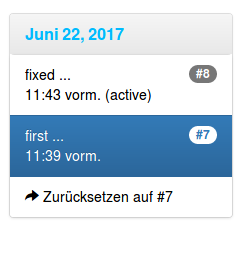
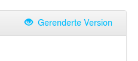

Usage
=====

(1) You can use this plugin if you want to add a trash bin for pages where all deleted pages will be kept until final
deletion.

(2) You can save breakpoints of pages in order to roll back to one of them. So called PageVersion.

(3) And finally you can work on different versions of a page by creating+editing page versions and in the end setting
one of them to the actual HEAD of the page.

The following paragraphs describe example workflows for 1-3.

Page bin
--------

The customer doesn't want pages to be deleted immediately. So we store them under a new root node.
To keep the JS tree of the frontend working, the total amount of deleted pages is divided into buckets.

It is possible to drag pages into the bin. We disable all of the buttons so the user cannot interact with the pages.
The pages in the bin are not visible because of djangoCMS's policy "unpublished pages must not have published children"

Page versions
-------------

Before editing a page (adding a plugin, changing content...) users might want to store the current state of the page.
Reversion2 adds a Toolbar menu entry called 'Version' with the following options:
 - create a new page version
 - show the history (all page versions that belong to the page)
 - create a page version for all pages that don't have a single page version

On creating a new page version the user can enter a title and description.

If a user wants to compare page versions, perform a rollback or edit snapshotted versions she or he has to use the
'History view'.

It is divided into three columns. The left sidebar is ordered by date and grouped by day. The collapsible with the
current active version is expanded by default. The hover contains the page version description.

By clicking on an entry in the sidebar the panel in the middle will change.

This panel shows the page version selected in the left sidebar. The right panel shows the calculated changes to the left
panel.

If you make changes to the page you can see the diff...

You can rollback in the left sidebar

Editing multiple version
------------------------

Clicking on the 'rendered version' link brings you the rendered page version. You can edit this version.
This enables teams to work on different versions of one page and in the end pick the better one or merge two page
versions (utter has to be done manually).

